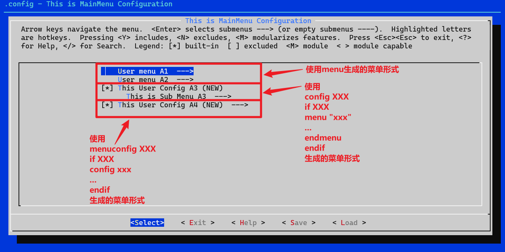
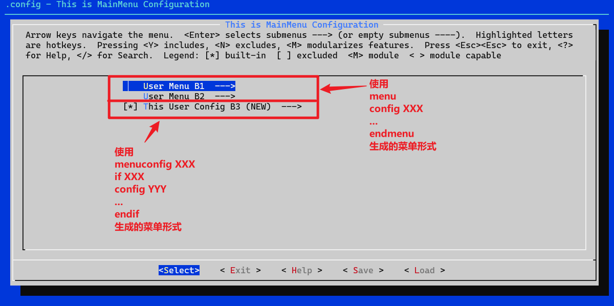

# 1. mainmenu

```kconfig
mainmenu "This is MainMenu Configuration"
```

效果：


生成.config

```makefile
#
# Automatically generated file; DO NOT EDIT.
# This is MainMenu Configuration
#
```

# 2. config

```kconfig
mainmenu "This is MainMenu Configuration"

config USER_CONFIG1
    bool "This User Config 1"
    ---help---
        User Config 1

config USER_CONFIG2
    bool "This User Config 2"
    default y
    ---help---
        User Config 2

config USER_CONFIG3
    bool "This User Config 3"
    ---help---
        User Config 3

config USER_CONFIG4
    bool "This User Config 4"
    ---help---
        User Config 4

config USER_CONFIG5
    bool "This User Config 5"
    ---help---
        User Config 5

config USER_CONFIG6
    bool "This User Config 6"
    ---help---
        User Config 6
```

效果：


生成.config

```makefile
#
# Automatically generated file; DO NOT EDIT.
# This is MainMenu Configuration
#
# CONFIG_USER_CONFIG1 is not set
CONFIG_USER_CONFIG2=y
# CONFIG_USER_CONFIG3 is not set
# CONFIG_USER_CONFIG4 is not set
# CONFIG_USER_CONFIG5 is not set
# CONFIG_USER_CONFIG6 is not set
```

# 3. menu

## 3.1. menu-A

```kconfig
mainmenu "This is MainMenu Configuration"

# 用户菜单A1
menu "User menu A1"
source "sub_A1/Kconfig"
endmenu

# 用户菜单A2
menu "User menu A2"
source "sub_A2/Kconfig"
endmenu

# 用户配置A3
config USER_CONFIG_A3
    bool "This User Config A3"
    default y
    ---help---
        User Config A3

# 子菜单
if USER_CONFIG_A3
menu "This is Sub Menu A3"
source "sub_A3/Kconfig"
endmenu
endif

# 用户配置A4
menuconfig USER_CONFIG_A4
    bool "This User Config A4"
    default y
    ---help---
        User Config A4

# 子菜单
if USER_CONFIG_A4
config USER_SUB_CONFIG_A4_1
    bool "This User Sub Config A4_1"
    ---help---
        User Sub Config A4_1

config USER_SUB_CONFIG_A4_2
    bool "This User Sub Config A4_2"
    default y
    ---help---
        User Sub Config A4_2

config USER_SUB_CONFIG_A4_3
    bool "This User Sub Config A4_3"
    ---help---
        User Config A4_3
endif
```

效果：



生成.config

```makefile
#
# Automatically generated file; DO NOT EDIT.
# This is MainMenu Configuration
#

#
# User menu A1
#
# CONFIG_USER_SUB_CONFIG_A1_1 is not set
CONFIG_USER_SUB_CONFIG_A1_2=y
# CONFIG_USER_SUB_CONFIG_A1_3 is not set

#
# User menu A2
#
# CONFIG_USER_SUB_CONFIG_A2_1 is not set
CONFIG_USER_SUB_CONFIG_A2_2=y
# CONFIG_USER_SUB_CONFIG_A2_3 is not set

#
# User SubMenu A2_4
#
# CONFIG_USER_SUB_CONFIG_A2_4_1 is not set
CONFIG_USER_SUB_CONFIG_A2_4_2=y
# CONFIG_USER_SUB_CONFIG_A2_4_3 is not set
CONFIG_USER_CONFIG_A3=y

#
# This is Sub Menu A3
#
# CONFIG_USER_SUB_CONFIG_A3_1 is not set
CONFIG_USER_SUB_CONFIG_A3_2=y
# CONFIG_USER_SUB_CONFIG_A3_3 is not set
CONFIG_USER_CONFIG_A4=y
# CONFIG_USER_SUB_CONFIG_A4_1 is not set
CONFIG_USER_SUB_CONFIG_A4_2=y
# CONFIG_USER_SUB_CONFIG_A4_3 is not set
```

## 4.2. menu-B

```kconfig
mainmenu "This is MainMenu Configuration"

# 用户菜单B1
menu "User Menu B1"
config USER_SUB_CONFIG_B1_1
    bool "This User Sub Config B1_1"
    ---help---
        User Sub Config B1_1

config USER_SUB_CONFIG_B1_2
    bool "This User Sub Config B1_2"
    default y
    ---help---
        User Sub Config B1_2

config USER_SUB_CONFIG_B1_3
    bool "This User Sub Config B1_3"
    ---help---
        User Config B1_3
endmenu

# 用户配置B2
menu "User Menu B2"
config USER_SUB_CONFIG_B2_1
    bool "This User Sub Config B2_1"
    ---help---
        User Sub Config B2_1

config USER_SUB_CONFIG_B2_2
    bool "This User Sub Config B2_2"
    default y
    ---help---
        User Sub Config B2_2

config USER_SUB_CONFIG_B2_3
    bool "This User Sub Config B2_3"
    ---help---
        User Config B2_3
endmenu

# 用户配置B3
menuconfig USER_CONFIG_B3
    bool "This User Config B3"
    default y
    ---help---
        User Config B3

# 子菜单
if USER_CONFIG_B3
config USER_SUB_CONFIG_B3_1
    bool "This User Sub Config B3_1"
    ---help---
        User Sub Config B3_1

config USER_SUB_CONFIG_B3_2
    bool "This User Sub Config B3_2"
    default y
    ---help---
        User Sub Config B3_2

config USER_SUB_CONFIG_B3_3
    bool "This User Sub Config B3_3"
    ---help---
        User Config B3_3
endif
```

效果：



生成.config

```makefile
#
# Automatically generated file; DO NOT EDIT.
# This is MainMenu Configuration
#

#
# User Menu B1
#
# CONFIG_USER_SUB_CONFIG_B1_1 is not set
CONFIG_USER_SUB_CONFIG_B1_2=y
# CONFIG_USER_SUB_CONFIG_B1_3 is not set

#
# User Menu B2
#
# CONFIG_USER_SUB_CONFIG_B2_1 is not set
CONFIG_USER_SUB_CONFIG_B2_2=y
# CONFIG_USER_SUB_CONFIG_B2_3 is not set
CONFIG_USER_CONFIG_B3=y
# CONFIG_USER_SUB_CONFIG_B3_1 is not set
CONFIG_USER_SUB_CONFIG_B3_2=y
# CONFIG_USER_SUB_CONFIG_B3_3 is not set
```

# 4. menuconfig

## 4.1. menuconfig-A

```kconfig
mainmenu "This is MainMenu Configuration"

# 用户配置A1
config USER_CONFIG_A1
    bool "This User Config A1"
    default y
    ---help---
        User Config A1

# 子菜单
source "subconfig_A1/Kconfig"

# 用户配置A2
config USER_CONFIG_A2
    bool "This User Config A2"
    default n
    ---help---
        User Config A2

# 子菜单
source "subconfig_A2/Kconfig"
```

效果：


生成.config

```makefile
#
# Automatically generated file; DO NOT EDIT.
# This is MainMenu Configuration
#
CONFIG_USER_CONFIG_A1=y

#
# This is Sub Menu A1
#
# CONFIG_USER_SUB_CONFIG_A1_1 is not set
CONFIG_USER_SUB_CONFIG_A1_2=y
# CONFIG_USER_SUB_CONFIG_A1_3 is not set
# CONFIG_USER_CONFIG_A2 is not set
```

## 4.2. menuconfig-B

```kconfig
mainmenu "This is MainMenu Configuration"

# 用户配置B1
menuconfig USER_CONFIG_B1
    bool "This User Config B1"
    default y
    ---help---
        User Config B1

# 子菜单
if USER_CONFIG_B1
config USER_SUB_CONFIG_B1_1
    bool "This User Sub Config B1_1"
    ---help---
        User Sub Config B1_1

config USER_SUB_CONFIG_B1_2
    bool "This User Sub Config B1_2"
    default y
    ---help---
        User Sub Config B1_2

config USER_SUB_CONFIG_B1_3
    bool "This User Sub Config B1_3"
    ---help---
        User Config B1_3
endif

# 用户配置B2
menuconfig USER_CONFIG_B2
    bool "This User Config B2"
    default n
    ---help---
        User Config B2

# 子菜单
if USER_CONFIG_B2
config USER_SUB_CONFIG_B2_1
    bool "This User Sub Config B2_1"
    ---help---
        User Sub Config B2_1

config USER_SUB_CONFIG_B2_2
    bool "This User Sub Config B2_2"
    default y
    ---help---
        User Sub Config B2_2

config USER_SUB_CONFIG_B2_3
    bool "This User Sub Config B2_3"
    ---help---
        User Config B2_3
endif
```

效果：


生成.config

```makefile
#
# Automatically generated file; DO NOT EDIT.
# This is MainMenu Configuration
#
CONFIG_USER_CONFIG_B1=y
# CONFIG_USER_SUB_CONFIG_B1_1 is not set
CONFIG_USER_SUB_CONFIG_B1_2=y
# CONFIG_USER_SUB_CONFIG_B1_3 is not set
# CONFIG_USER_CONFIG_B2 is not set
```

## 4.3. menuconfig-C

```kconfig
mainmenu "This is MainMenu Configuration"

# 用户配置C1
menuconfig USER_CONFIG_C1
    bool "This User Config C1"
    default y
    ---help---
        User Config C1

# 子菜单
config USER_SUB_CONFIG_C1_1
    bool "This User Sub Config C1_1"
    depends on USER_CONFIG_C1
    ---help---
        User Sub Config C1_1

config USER_SUB_CONFIG_C1_2
    bool "This User Sub Config C1_2"
    depends on USER_CONFIG_C1
    default y
    ---help---
        User Sub Config C1_2

config USER_SUB_CONFIG_C1_3
    bool "This User Sub Config C1_3"
    depends on USER_CONFIG_C1
    ---help---
        User Sub Config C1_3

# 用户配置C2
menuconfig USER_CONFIG_C2
    bool "This User Config C2"
    ---help---
        User Config C2

# 子菜单
config USER_SUB_CONFIG_C2_1
    bool "This User Sub Config C2_1"
    depends on USER_CONFIG_C2
    ---help---
        User Sub Config C2_1

config USER_SUB_CONFIG_C2_2
    bool "This User Sub Config C2_2"
    depends on USER_CONFIG_C2
    default y
    ---help---
        User Sub Config C2_2

config USER_SUB_CONFIG_C2_3
    bool "This User Sub Config C2_3"
    depends on USER_CONFIG_C2
    ---help---
        User Sub Config C2_3
```

效果：


生成.config

```makefile
#
# Automatically generated file; DO NOT EDIT.
# This is MainMenu Configuration
#
CONFIG_USER_CONFIG_C1=y
# CONFIG_USER_SUB_CONFIG_C1_1 is not set
CONFIG_USER_SUB_CONFIG_C1_2=y
# CONFIG_USER_SUB_CONFIG_C1_3 is not set
# CONFIG_USER_CONFIG_C2 is not set
```

## 4.4. menuconfig-D

```kconfig
mainmenu "This is MainMenu Configuration"

# 用户配置D1
menuconfig USER_CONFIG_D1
    bool "This User Config D1"
    default y
    ---help---
        User Config D1

config USER_SUB_CONFIG_D1_1
    bool "This User Sub Config D1_1"
    default y
    ---help---
        User Sub Config D1_1

if USER_CONFIG_D1
config USER_SUB_CONFIG_D1_2
    bool "This User Sub Config D1_2"
    default y
    ---help---
        User Sub Config D1_2

config USER_SUB_CONFIG_D1_3
    bool "This User Sub Config D1_3"
    ---help---
        User Sub Config D1_3
endif

# 用户配置D2
menuconfig USER_CONFIG_D2
    bool "This User Config D2"
    ---help---
        User Config D2

config USER_SUB_CONFIG_D2_1
    bool "This User Sub Config D2_1"
    default y
    ---help---
        User Sub Config D2_1

if USER_CONFIG_D2
config USER_SUB_CONFIG_D2_2
    bool "This User Sub Config D2_2"
    default y
    ---help---
        User Sub Config D2_2

config USER_SUB_CONFIG_D2_3
    bool "This User Sub Config D2_3"
    ---help---
        User Sub Config D2_3
endif
```

效果：


生成.config

```makefile
#
# Automatically generated file; DO NOT EDIT.
# This is MainMenu Configuration
#
CONFIG_USER_CONFIG_D1=y
CONFIG_USER_SUB_CONFIG_D1_1=y
# CONFIG_USER_SUB_CONFIG_D1_2 is not set
CONFIG_USER_SUB_CONFIG_D1_3=y
# CONFIG_USER_CONFIG_D2 is not set
CONFIG_USER_SUB_CONFIG_D2_1=y
CONFIG_USER_CONFIG_D3=y
CONFIG_USER_SUB_CONFIG_D3_1=y
# CONFIG_USER_SUB_CONFIG_D3_2 is not set
CONFIG_USER_SUB_CONFIG_D3_3=y
# CONFIG_USER_CONFIG_D4 is not set
CONFIG_USER_SUB_CONFIG_D4_3=y
```

## 4.5. menuconfig-E

```kconfig
mainmenu "This is MainMenu Configuration"

# 用户配置E1
menuconfig USER_CONFIG_E1
    bool "This User Config E1"
    default y
    ---help---
        User Config E1

config USER_SUB_CONFIG_E1_1
    bool "This User Sub Config E1_1"
    default y
    ---help---
        User Sub Config E1_1

config USER_SUB_CONFIG_E1_2
    bool "This User Sub Config E1_2"
    depends on USER_CONFIG_E1
    ---help---
        User Sub Config E1_2

config USER_SUB_CONFIG_E1_3
    bool "This User Sub Config E1_3"
    depends on USER_CONFIG_E1
    default y
    ---help---
        User Sub Config E1_3

# 用户配置E2
menuconfig USER_CONFIG_E2
    bool "This User Config E2"
    ---help---
        User Config E2

config USER_SUB_CONFIG_E2_1
    bool "This User Sub Config E2_1"
    default y
    ---help---
        User Sub Config E2_1

config USER_SUB_CONFIG_E2_2
    bool "This User Sub Config E2_2"
    depends on USER_CONFIG_E2
    ---help---
        User Sub Config E2_2

config USER_SUB_CONFIG_E2_3
    bool "This User Sub Config E2_3"
    depends on USER_CONFIG_E2
    default y
    ---help---
        User Sub Config E2_3

# 用户配置E3
menuconfig USER_CONFIG_E3
    bool "This User Config E3"
    default y
    ---help---
        User Config E3

config USER_SUB_CONFIG_E3_1
    bool "This User Sub Config E3_1"
    depends on USER_CONFIG_E3
    default y
    ---help---
        User Sub Config E3_1

config USER_SUB_CONFIG_E3_2
    bool "This User Sub Config E3_2"
    depends on USER_CONFIG_E3
    ---help---
        User Sub Config E3_2

config USER_SUB_CONFIG_E3_3
    bool "This User Sub Config E3_3"
    default y
    ---help---
        User Sub Config E3_3

# 用户配置E4
menuconfig USER_CONFIG_E4
    bool "This User Config E4"
    ---help---
        User Config E4

config USER_SUB_CONFIG_E4_1
    bool "This User Sub Config E4_1"
    depends on USER_CONFIG_E4
    default y
    ---help---
        User Sub Config E4_1

config USER_SUB_CONFIG_E4_2
    bool "This User Sub Config E4_2"
    depends on USER_CONFIG_E4
    ---help---
        User Sub Config E4_2

config USER_SUB_CONFIG_E4_3
    bool "This User Sub Config E4_3"
    default y
    ---help---
        User Sub Config E4_3
```

效果：


生成.config

```makefile
#
# Automatically generated file; DO NOT EDIT.
# This is MainMenu Configuration
#
CONFIG_USER_CONFIG_E1=y
CONFIG_USER_SUB_CONFIG_E1_1=y
# CONFIG_USER_SUB_CONFIG_E1_2 is not set
CONFIG_USER_SUB_CONFIG_E1_3=y
# CONFIG_USER_CONFIG_E2 is not set
CONFIG_USER_SUB_CONFIG_E2_1=y
CONFIG_USER_CONFIG_E3=y
CONFIG_USER_SUB_CONFIG_E3_1=y
# CONFIG_USER_SUB_CONFIG_E3_2 is not set
CONFIG_USER_SUB_CONFIG_E3_3=y
# CONFIG_USER_CONFIG_E4 is not set
CONFIG_USER_SUB_CONFIG_E4_3=y
```

# 5. choice

```kconfig
mainmenu "This is MainMenu Configuration"

choice
    prompt "User Config Choice"
    default USER_CONFIG3

config USER_CONFIG1
    bool "This User Config 1"
    ---help---
        User Config 1

config USER_CONFIG2
    bool "This User Config 2"
    ---help---
        User Config 2

config USER_CONFIG3
    bool "This User Config 3"
    ---help---
        User Config 3

config USER_CONFIG4
    bool "This User Config 4"
    ---help---
        User Config 4

config USER_CONFIG5
    bool "This User Config 5"
    ---help---
        User Config 5

config USER_CONFIG6
    bool "This User Config 6"
    ---help---
        User Config 6
endchoice
```

效果：


生成.config

```makefile
#
# Automatically generated file; DO NOT EDIT.
# This is MainMenu Configuration
#
# CONFIG_USER_CONFIG1 is not set
# CONFIG_USER_CONFIG2 is not set
CONFIG_USER_CONFIG3=y
# CONFIG_USER_CONFIG4 is not set
# CONFIG_USER_CONFIG5 is not set
# CONFIG_USER_CONFIG6 is not set
```

# 6. comment

```kconfig
mainmenu "This is MainMenu Configuration"

comment "This is comment"

config USER_CONFIG1
    bool "This User Config 1"
    ---help---
        User Config 1

comment "This is User Config1 Comment"
    depends on USER_CONFIG1

config USER_CONFIG2
    bool "This User Config 2"
    ---help---
        User Config 2

comment "This is User Config2 Comment"
    depends on !USER_CONFIG2

config USER_CONFIG3
    bool "This User Config 3"
    ---help---
        User Config 3

if USER_CONFIG3
comment "This is User Config3 Comment"
endif
```

效果：


生成.config

```makefile
#
# Automatically generated file; DO NOT EDIT.
# This is MainMenu Configuration
#

#
# This is comment
#
# CONFIG_USER_CONFIG1 is not set
# CONFIG_USER_CONFIG2 is not set

#
# This is User Config2 Comment
#
# CONFIG_USER_CONFIG3 is not set
```

# 7. select

```kconfig
mainmenu "This is MainMenu Configuration"

comment "User config A"

config USER_CONFIG_A1
    bool "This User Config A1"
    default y
    select USER_CONFIG_A2
    select USER_CONFIG_A3
    imply  USER_CONFIG_A4
    imply  USER_CONFIG_A5
    imply  USER_CONFIG_A6
    ---help---
        User Config A1

config USER_CONFIG_A2
    bool "This User Config A2"
    ---help---
        User Config A2

config USER_CONFIG_A3
    bool "This User Config A3"
    ---help---
        User Config A3

config USER_CONFIG_A4
    bool "This User Config A4"
    default y
    ---help---
        User Config A4

config USER_CONFIG_A5
    bool "This User Config A5"
    default y
    ---help---
        User Config A5

config USER_CONFIG_A6
    bool "This User Config A6"
    ---help---
        User Config A6

comment "User config B"

config USER_CONFIG_B1
    bool "This User Config B1"
    select USER_CONFIG_B2
    select USER_CONFIG_B3
    imply  USER_CONFIG_B4
    imply  USER_CONFIG_B5
    imply  USER_CONFIG_B6
    ---help---
        User Config B1

config USER_CONFIG_B2
    bool "This User Config B2"
    ---help---
        User Config B2

config USER_CONFIG_B3
    bool "This User Config B3"
    ---help---
        User Config B3

config USER_CONFIG_B4
    bool "This User Config B4"
    default y
    ---help---
        User Config B4

config USER_CONFIG_B5
    bool "This User Config B5"
    default y
    ---help---
        User Config B5

config USER_CONFIG_B6
    bool "This User Config B6"
    ---help---
        User Config B6
```

效果：


生成.config

```makefile
#
# Automatically generated file; DO NOT EDIT.
# This is MainMenu Configuration
#

#
# User config A
#
CONFIG_USER_CONFIG_A1=y
CONFIG_USER_CONFIG_A2=y
CONFIG_USER_CONFIG_A3=y
CONFIG_USER_CONFIG_A4=y
CONFIG_USER_CONFIG_A5=y
CONFIG_USER_CONFIG_A6=y

#
# User config B
#
# CONFIG_USER_CONFIG_B1 is not set
# CONFIG_USER_CONFIG_B2 is not set
# CONFIG_USER_CONFIG_B3 is not set
CONFIG_USER_CONFIG_B4=y
CONFIG_USER_CONFIG_B5=y
# CONFIG_USER_CONFIG_B6 is not set
```

# 8. imply

```kconfig
mainmenu "This is MainMenu Configuration"

comment "User config A"

config USER_CONFIG_A1
    bool "This User Config A1"
    default y
    select USER_CONFIG_A2
    select USER_CONFIG_A3
    imply  USER_CONFIG_A4
    imply  USER_CONFIG_A5
    imply  USER_CONFIG_A6
    ---help---
        User Config A1

config USER_CONFIG_A2
    bool "This User Config A2"
    ---help---
        User Config A2

config USER_CONFIG_A3
    bool "This User Config A3"
    ---help---
        User Config A3

config USER_CONFIG_A4
    bool "This User Config A4"
    default y
    ---help---
        User Config A4

config USER_CONFIG_A5
    bool "This User Config A5"
    default y
    ---help---
        User Config A5

config USER_CONFIG_A6
    bool "This User Config A6"
    ---help---
        User Config A6

comment "User config B"

config USER_CONFIG_B1
    bool "This User Config B1"
    select USER_CONFIG_B2
    select USER_CONFIG_B3
    imply  USER_CONFIG_B4
    imply  USER_CONFIG_B5
    imply  USER_CONFIG_B6
    ---help---
        User Config B1

config USER_CONFIG_B2
    bool "This User Config B2"
    ---help---
        User Config B2

config USER_CONFIG_B3
    bool "This User Config B3"
    ---help---
        User Config B3

config USER_CONFIG_B4
    bool "This User Config B4"
    default y
    ---help---
        User Config B4

config USER_CONFIG_B5
    bool "This User Config B5"
    default y
    ---help---
        User Config B5

config USER_CONFIG_B6
    bool "This User Config B6"
    ---help---
        User Config B6
```

效果：


生成.config

```makefile
#
# Automatically generated file; DO NOT EDIT.
# This is MainMenu Configuration
#

#
# User config A
#
CONFIG_USER_CONFIG_A1=y
CONFIG_USER_CONFIG_A2=y
CONFIG_USER_CONFIG_A3=y
CONFIG_USER_CONFIG_A4=y
CONFIG_USER_CONFIG_A5=y
CONFIG_USER_CONFIG_A6=y

#
# User config B
#
# CONFIG_USER_CONFIG_B1 is not set
# CONFIG_USER_CONFIG_B2 is not set
# CONFIG_USER_CONFIG_B3 is not set
CONFIG_USER_CONFIG_B4=y
CONFIG_USER_CONFIG_B5=y
# CONFIG_USER_CONFIG_B6 is not set
```

# 9. range

```kconfig
mainmenu "This is MainMenu Configuration"

config START_YEAR
    int "Start year"
    default 2018
    range 1970 2106
    ---help---
        Start year config

config MEMORY_START
    hex "Memory Start"
    default 0x00001000
    range 0 0x00008000
    ---help---
        Memory Start config
```

效果：


生成.config

```makefile
#
# Automatically generated file; DO NOT EDIT.
# This is MainMenu Configuration
#
CONFIG_START_YEAR=2018
CONFIG_MEMORY_START=0x00001000
```

# 10. prompt

```kconfig
mainmenu "This is MainMenu Configuration"

# 带有prompt属性的配置会在界面上出现
config USER_CONFIG1
    bool "This User Config 1"
    ---help---
        User Config 1

config USER_CONFIG2
    bool "This User Config 2"
    default y
    select USER_CONFIG4
    ---help---
        User Config 2

config USER_CONFIG3
    bool
    prompt "This User Config 3"
    select USER_CONFIG5
    select USER_CONFIG6
    ---help---
        User Config 3

# 不带prompt属性的配置不出现在界面上,只能依赖于别的配置来间接选择
config USER_CONFIG4
    bool
    ---help---
        User Config 4

config USER_CONFIG5
    bool
    ---help---
        User Config 5

config USER_CONFIG6
    bool
    ---help---
        User Config 6
```

效果：


生成.config

```makefile
#
# Automatically generated file; DO NOT EDIT.
# This is MainMenu Configuration
#
# CONFIG_USER_CONFIG1 is not set
CONFIG_USER_CONFIG2=y
# CONFIG_USER_CONFIG3 is not set
CONFIG_USER_CONFIG4=y
```
